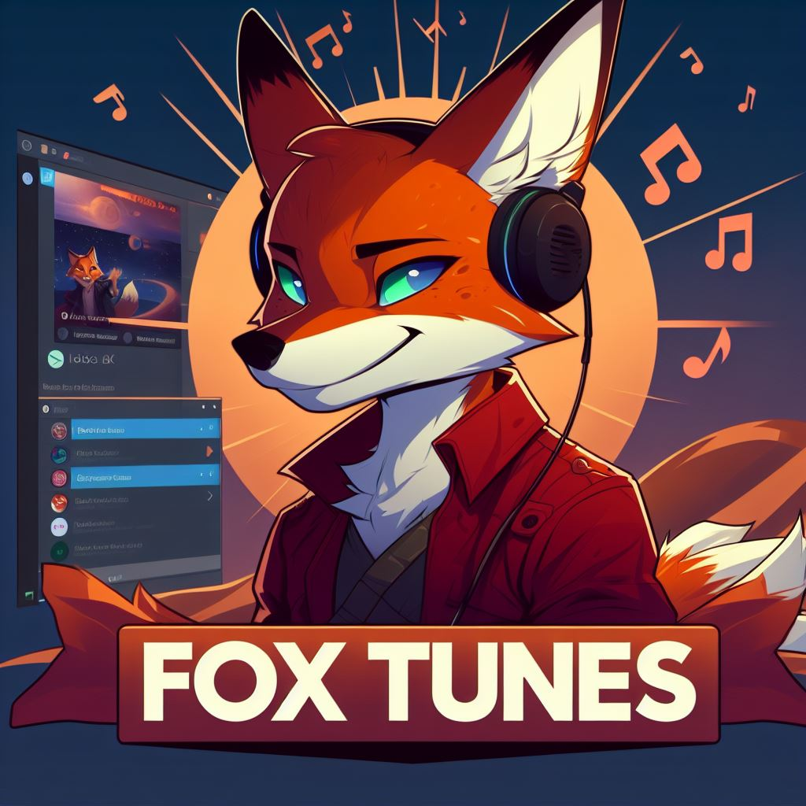

# FoxTunes

#### Discord bot for music playback Author: David Kanovský

## Special thanks 
### App testers
Erik Graf, Aleš Najser, Odra Vícha, Robin Harazim, Jiří Ryba, Lukáš Kanovský
### Dev app logo

 Lukáš Kanovský

# About 
This project focuses on the development of a Discord bot (automated user) written in TypeScript, enabling users to play music from various platforms such as YouTube and Spotify with a single command. Users also have the option to create their own playlist to save
music, which is automatically uploaded to a MongoDB database. Users can further save
their favorite music to this database using a button embedded in a message containing information about the currently playing music. Modern technologies and the TypeScript programming language were used in the development, with particular emphasis on integrating
Lavalink for optimized music playback.

## Useful links
- [Documentation](./dokumentace/zaverecna_prace_David_Kanovsky.pdf)
- [Presentation](https://www.youtube.com/watch?v=F73k6-1O81Q)
